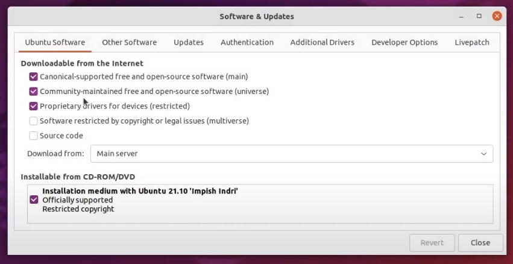
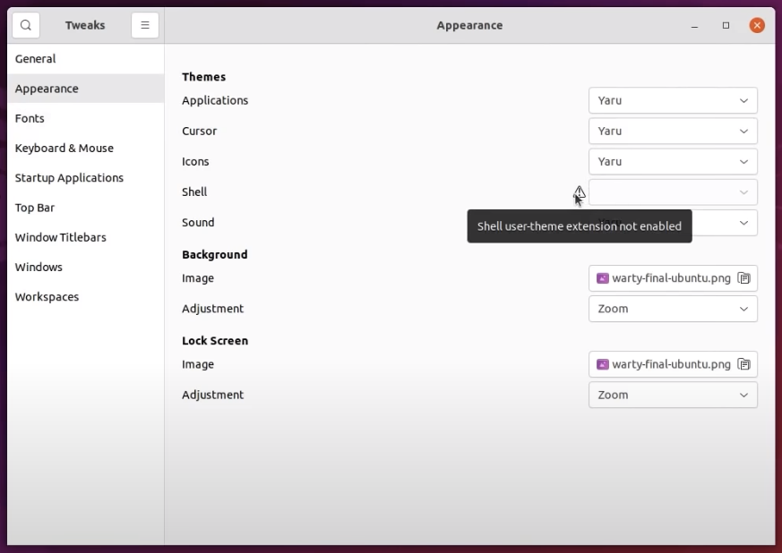
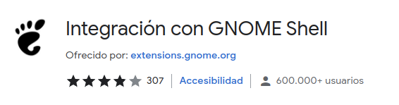
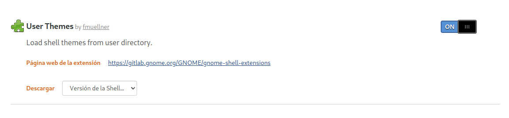
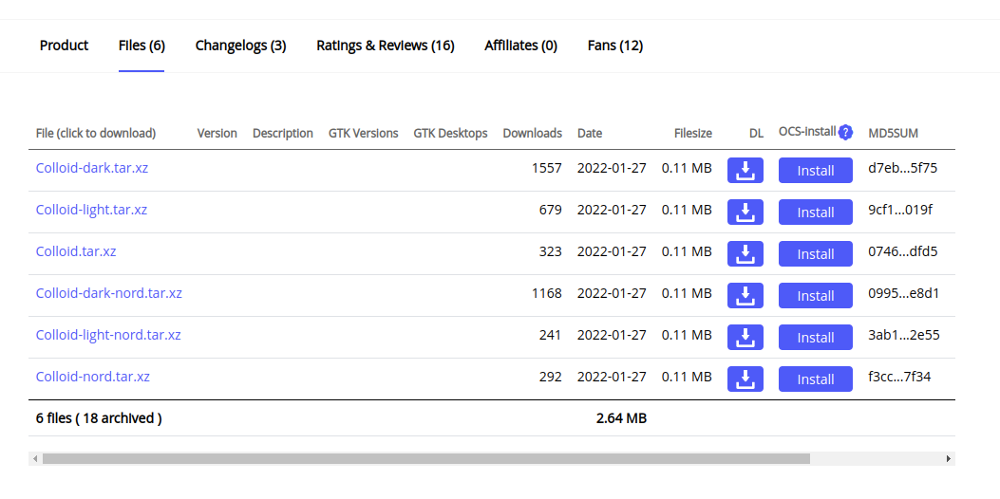
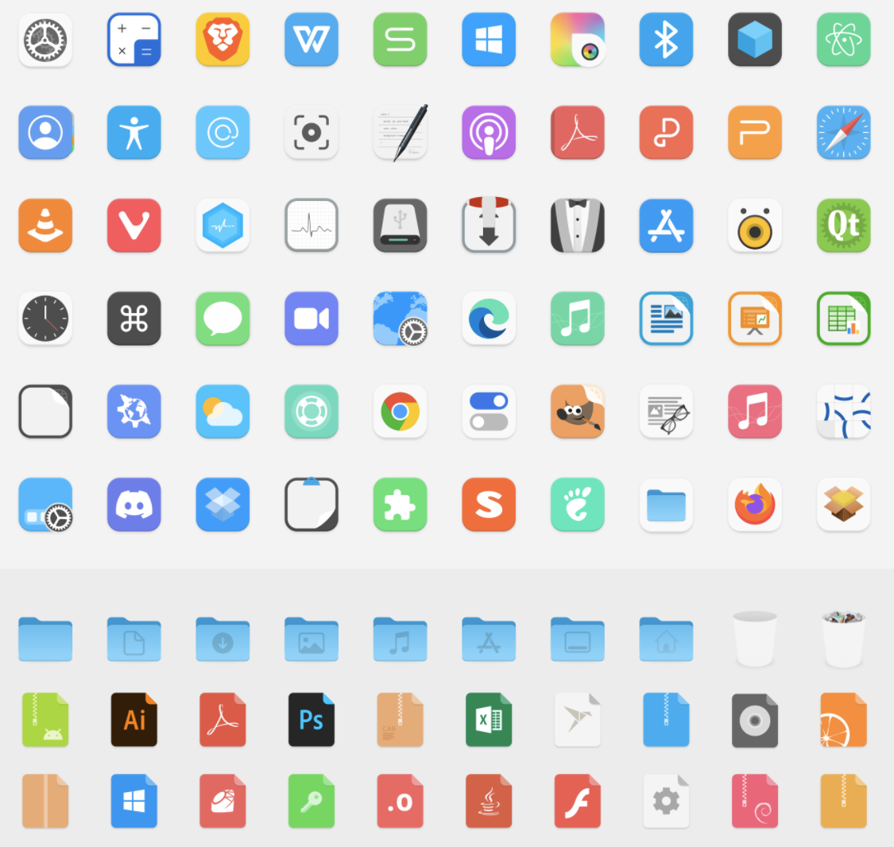
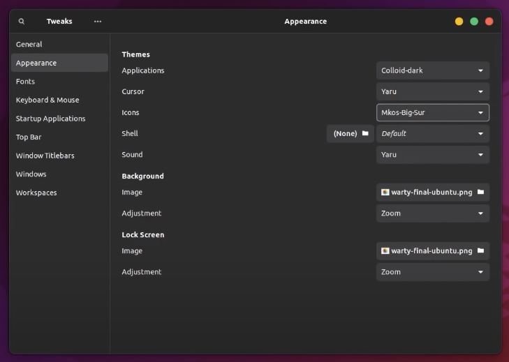

# GNOME Customization - Nord Theme - Ubuntu 20.04

Source video: [link](https://www.youtube.com/watch?v=gx1hEQSOAyg) Youtube Channel: [link](https://www.youtube.com/channel/UCtKKEqJIPCT9E6WMas7lC5Q)

### First checks

Open Software and Update >> checkbox **Comunity-mainteined free and open-source software (universe)** is checked.



________________________________________

##### Install and check gnome-tweaks

Open terminal `ctrl + al + t`

```bash
sudo apt install gnome-tweaks -y
```

Search Gnome-Teaks on the applications and check:
- Lateral left Menu >> Appearance >> Shell
  - Is not with exclamation **(!)** symbol.



If it has the exclamation symbol need install a plugin for Gnome-Extensions:

Go to: [Chrome Extensions >> Gnome Shell extension](https://chrome.google.com/webstore/detail/gnome-shell-integration/gphhapmejobijbbhgpjhcjognlahblep?hl=en)
add the extension to the browser.



Need now add the User Themes form Gnome Extensions, go to [WEB](https://extensions.gnome.org/), search **User-Themes** and activate the extension



This enable the user themas instalation on the OS.

Open **Tweaks** app and varify if the **Appearance >> Shell** is enabled.

_____________________________

### Install user theme and icons set

Go to [Gnome-Look](https://www.gnome-look.org/p/1661959/) 
web and search the [Colloid Theme](https://www.gnome-look.org/p/1661959/) 
or [GitHub](https://github.com/vinceliuice/Colloid-gtk-theme) for review more image of the theme

From section **Files** in [Colloid Theme](https://www.gnome-look.org/p/1661959/) download the theme you like.



Download the set Icons >> [Icons](https://www.gnome-look.org/p/1661983/)



Now on the home folder create the folder `.themes` and `.icons`

UnZip the themes on the `.themes` folder and the same for the icons on the `.icons` folder.

Now the themes and the icons are installed and can be selected on the **Tweaks app >> Appareance**



_____________________________

### Set better appearance

- Go to [Gnome Extension](https://extensions.gnome.org/) and search and install Dash to Dock extension [here](https://extensions.gnome.org/extension/307/dash-to-dock/)
put the tool icon bar on the bottom side.

- Put the clock on the right side with this extension [Frippery Move Clock](https://extensions.gnome.org/extension/2/move-clock/)

- Change the appearance of application menu [Frippery Applications Menu](https://extensions.gnome.org/extension/13/applications-menu/)

- Remove App Menu [Remove App Menu](https://extensions.gnome.org/extension/3906/remove-app-menu/)


_____________________________

### Set your wallpaper

Inspiration for free [here](https://www.google.com/search?q=nord%20wallpapers&tbm=isch&tbs=isz:l&hl=es&sa=X&ved=0CAIQpwVqFwoTCLCXsIfG5PUCFQAAAAAdAAAAABAS&biw=2545&bih=1303#imgrc=agWplNuA0LfJpM)

_____________________________

### Install and configure Conky (desktop cpu, free space and date live update)

Open terminal `ctrl + al + t` and install 

```bash
sudo apt install conky -y
```

Download the basic config for Conky in this GitHub [repo](https://github.com/junaidrahim/conky-clock/blob/master/Screenshot.png)

Link raw [config](https://raw.githubusercontent.com/junaidrahim/conky-clock/master/conky.conf)

Open the file `/etc/conky/conky.conf` and replace the content with the new one.

On the terminal run this command to activate the Conky

```bash
conky
```